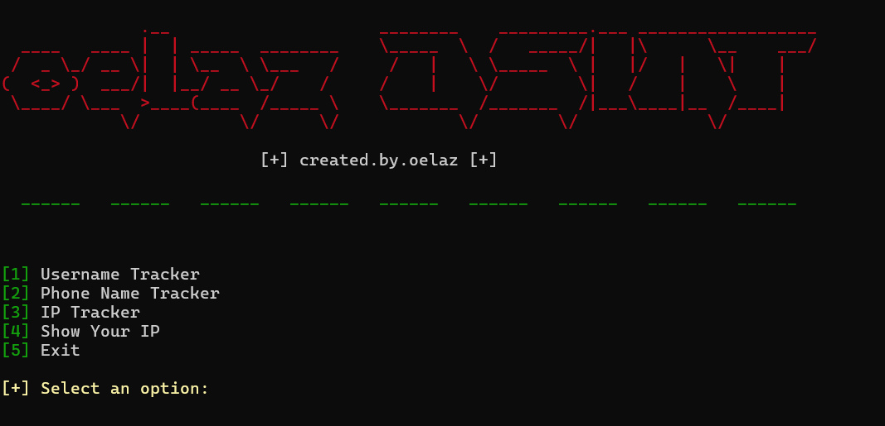
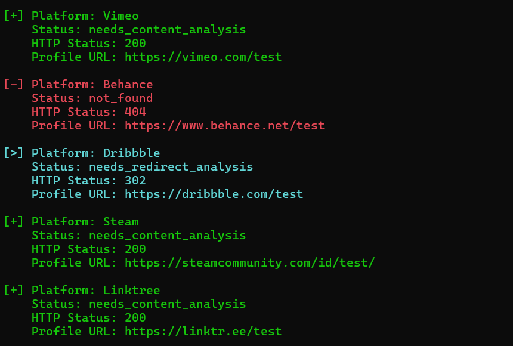
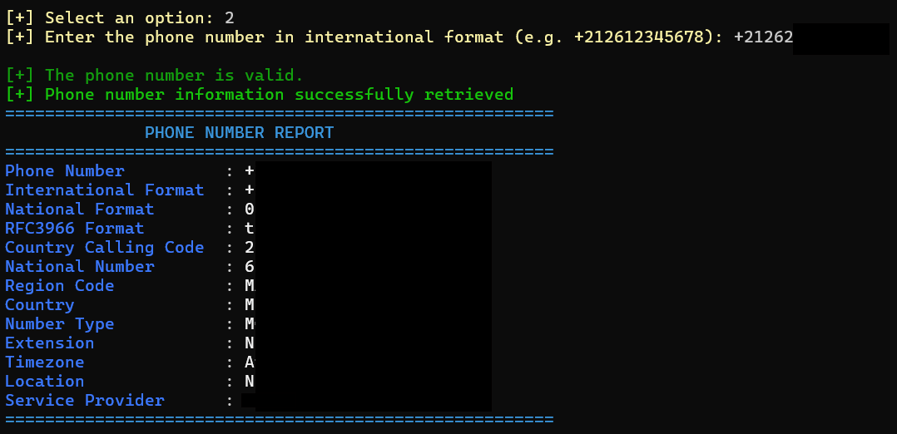
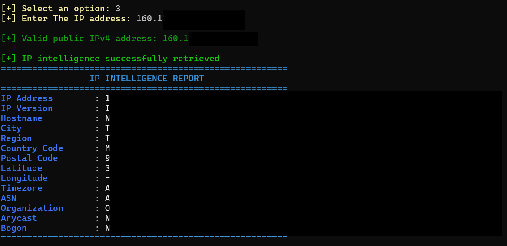
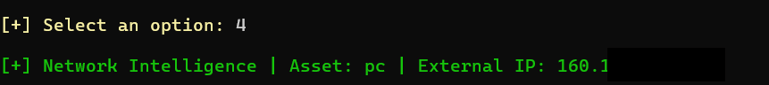
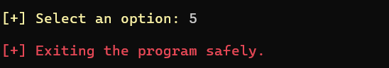

<p align="center">
  
</p>

<p align="center">
  
  
  
  
</p>

<p align="center">
  
</p>

## 🚀 Getting Started

### 1. Install dependencies

```bash
pip install -r requirements.txt
```

### 2. Launch the application

```bash
python3 -m home
```

---

## 🏠 Main Menu

<p align="center">
  
</p>

The toolkit provides four OSINT modules:

- 👤 Username Tracker
- 📱 Phone Number Tracker
- 🌍 IP Tracker
- 🌐 Show Your Public IP

---

## 👤 Username Tracker

<p align="center">
  
</p>

The username tracker searches multiple platforms and displays:

- Platform name
- Detection status
- HTTP status code
- Profile URL

---

## 📱 Phone Number Intelligence

<p align="center">
  
</p>

The phone intelligence module displays:

- International format
- National format
- RFC3966 format
- Country calling code
- National number
- Region
- Country
- Number type
- Extension
- Time zone
- Location
- Service provider

---

## 🌍 IP Intelligence

<p align="center">
  
</p>

The IP tracker returns:

- IP version
- Hostname
- City
- Region
- Country code
- Postal code
- Latitude
- Longitude
- Time zone
- ASN
- Organization
- Anycast
- Bogon status

---

## 🌐 Show Your Public IP

<p align="center">
  
</p>

Displays the current public IP address of the host running the application.

---

## 🚪 Exit

<p align="center">
  
</p>

Safely terminates the application.